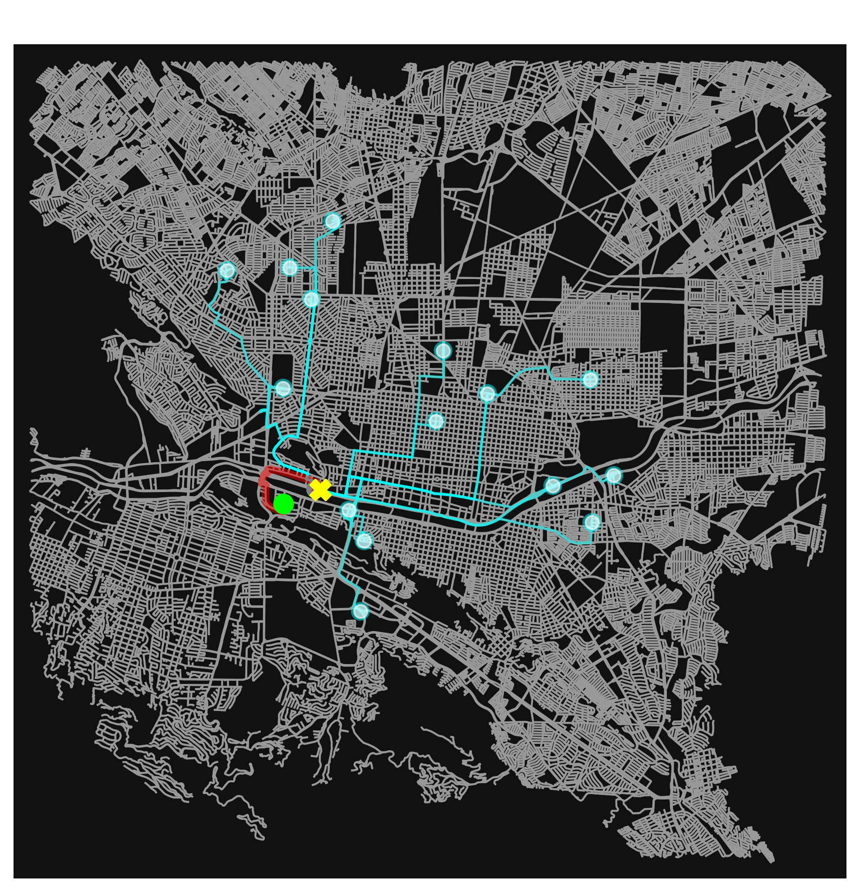

# Sistema Inteligente de Despacho de Ambulancias (Ruta Mínima)


Un simulador interactivo y modelo matemático de Investigación de Operaciones diseñado para optimizar los tiempos de respuesta de los servicios de emergencia en la Zona Metropolitana de Monterrey, Nuevo León.

## Descripción del Proyecto

En emergencias médicas, la "Hora Dorada" es vital. El despacho tradicional basado en distancia lineal (proximidad geográfica) suele ser ineficiente debido a la congestión vehicular. 

Este proyecto modela la red vial real de la ciudad como un grafo complejo y utiliza el **Algoritmo de Dijkstra** para determinar la **Ruta Mínima de Tiempo**. El sistema evalúa 16 bases operativas simultáneamente, aplicando penalizaciones algorítmicas de tráfico basadas en la estacionalidad (día de la semana y hora) para despachar la unidad más rápida, no necesariamente la más cercana.

## Características Principales

* ** Topología Real:** Extracción de la red vial de Monterrey (radio de 8 km) mediante `osmnx` y OpenStreetMap.
* **Tráfico Dinámico Estacional:** Multiplicadores de tráfico inyectados vía `pandas` que diferencian entre Horas Pico Laborales, Picos Comerciales de Fin de Semana y Horas Valle.
* **Geocodificación Interactiva:** El sistema traduce direcciones de texto (ej. "Parque Fundidora") a coordenadas geoespaciales precisas en tiempo real.
* **Jerarquía Visual:** Renderizado del mapa de la ciudad mostrando el "Top 3" de bases más rápidas, destacando la ruta óptima en rojo sobre rutas alternativas en cian.
* **Reportes Automáticos:** Exportación de cada simulación como un gráfico de alta resolución (.png) listo para informes gerenciales.

## Tecnologías Utilizadas

* **Python** (Lenguaje principal)
* **NetworkX:** Motor de resolución matemática (Teoría de Grafos / Ruta Mínima).
* **OSMnx:** Cartografía, imputación de velocidades y geocodificación.
* **Pandas:** Procesamiento vectorial masivo de los costos de aristas (pesos de tráfico).
* **Matplotlib:** Renderizado de la interfaz visual y exportación de reportes.

## Instalación y Uso

### Prerrequisitos
Se recomienda utilizar un entorno virtual. Instala las dependencias necesarias ejecutando en la consola del entorno:
```bash
pip install osmnx networkx pandas matplotlib
```

## Ejecución
Para iniciar el Centro de Comando Interactivo, ejecuta el archivo principal:
```bash
python main.py
```
1. El sistema verificará si existe el archivo de caché local (.graphml). Si no existe, descargará el mapa de la ciudad (puede tardar un par de minutos la primera vez).
2. Ingresa una dirección o punto de referencia en Monterrey (ej. Macroplaza).
3. Ingresa el día de la semana y la hora de la emergencia (formato 24h).
4. El sistema calculará la matriz, imprimirá las indicaciones de navegación del Top 3 y abrirá la ventana gráfica con la ruta.

## Ejemplo de visualización

